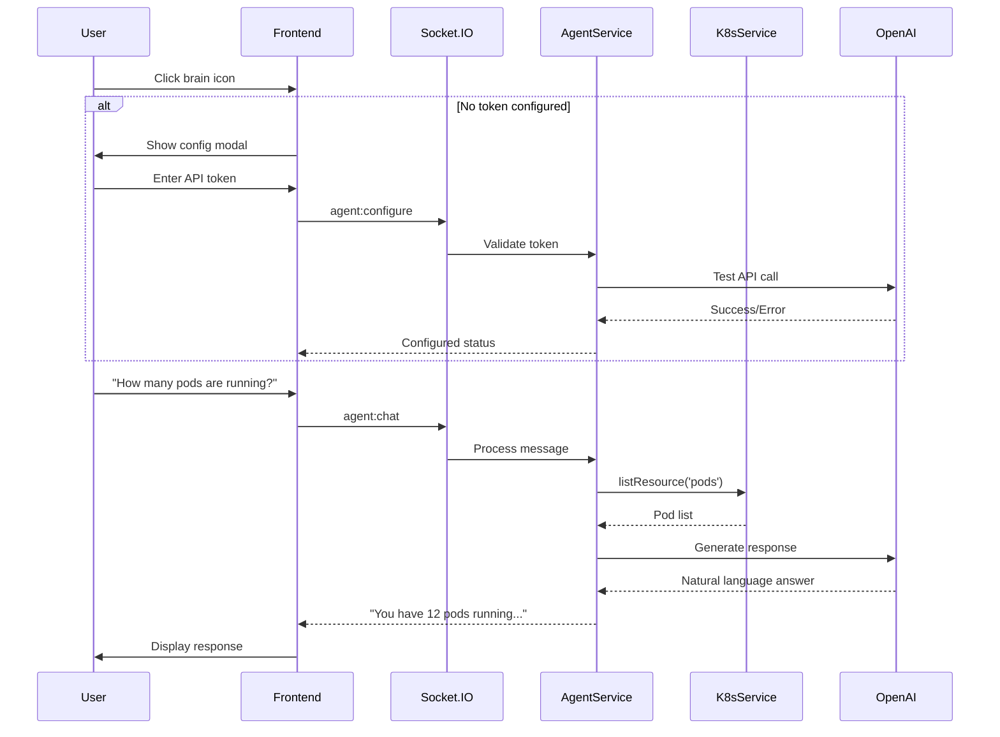

```mermaid
sequenceDiagram
    participant User
    participant Frontend
    participant Socket.IO
    participant AgentService
    participant K8sService
    participant OpenAI

    User->>Frontend: Click brain icon
    alt No token configured
        Frontend->>User: Show config modal
        User->>Frontend: Enter API token
        Frontend->>Socket.IO: agent:configure
        Socket.IO->>AgentService: Validate token
        AgentService->>OpenAI: Test API call
        OpenAI-->>AgentService: Success/Error
        AgentService-->>Frontend: Configured status
    end

    User->>Frontend: "How many pods are running?"
    Frontend->>Socket.IO: agent:chat
    Socket.IO->>AgentService: Process message
    AgentService->>K8sService: listResource('pods')
    K8sService-->>AgentService: Pod list
    AgentService->>OpenAI: Generate response
    OpenAI-->>AgentService: Natural language answer
    AgentService-->>Frontend: "You have 12 pods running..."
    Frontend->>User: Display response
```
