# Pod Diagnosis Feature

## Overview

AI-powered pod diagnosis that collects Kubernetes diagnostic data (pod details, events, container logs), sends it to OpenAI GPT-4o with structured output, and displays a rich analysis report with root cause, confidence score, severity, timeline, recommended fixes, and preventive measures.

---

## Architecture

### Data Flow

```mermaid
sequenceDiagram
    participant User
    participant Pods.tsx
    participant PodDiagnosisDialog
    participant "POST /api/diagnose" as API
    participant diagnosis.service
    participant K8sService
    participant OpenAI

    User->>Pods.tsx: Clicks 🔬 icon on pod row
    Pods.tsx->>PodDiagnosisDialog: Opens dialog
    PodDiagnosisDialog->>API: POST {namespace, podName, apiKey}
    API->>diagnosis.service: diagnosePod()
    diagnosis.service->>K8sService: getPodEvents()
    diagnosis.service->>K8sService: getPodLogsSnapshot() (per container)
    diagnosis.service->>K8sService: listResource('pods')
    diagnosis.service->>OpenAI: withStructuredOutput(DiagnosisReportSchema)
    OpenAI-->>diagnosis.service: Typed DiagnosisReport
    diagnosis.service-->>API: {report, rawData}
    API-->>PodDiagnosisDialog: JSON response
    PodDiagnosisDialog-->>User: Renders structured report
```



### Component Diagram


---

## Files Changed

### Backend

| File                                           | Type     | Description                                                                                                                                                                    |
| ---------------------------------------------- | -------- | ------------------------------------------------------------------------------------------------------------------------------------------------------------------------------ |
| `backend/src/services/kubernetes.service.ts`   | Modified | Added `getPodEvents()` — fetches K8s events filtered by pod name. Added `getPodLogsSnapshot()` — one-shot (non-streaming) log fetch for diagnosis context                      |
| `backend/src/agent/diagnosis.service.ts`       | **New**  | Core diagnosis service. Collects pod info, events, and container logs, then calls OpenAI with LangChain's `.withStructuredOutput()` using a Zod schema to guarantee typed JSON |
| `backend/src/agent/tools/diagnose-pod.tool.ts` | **New**  | LangChain `DynamicStructuredTool` wrapping the diagnosis service, enabling the chat agent to trigger diagnosis conversationally                                                |
| `backend/src/agent/tools/index.ts`             | Modified | Registered `diagnose_pod` tool. `createAllTools()` now accepts optional `apiKey` parameter                                                                                     |
| `backend/src/agent/agent.service.ts`           | Modified | Passes user's API key to `createAllTools()` so the diagnose tool is available                                                                                                  |
| `backend/src/routes/resource.route.ts`         | Modified | Added `POST /api/diagnose` REST endpoint accepting `{namespace, podName, apiKey}`                                                                                              |

### Frontend

| File                                                                       | Type     | Description                                                                                                                                                                 |
| -------------------------------------------------------------------------- | -------- | --------------------------------------------------------------------------------------------------------------------------------------------------------------------------- |
| `frontend/src/interfaces/diagnosis.ts`                                     | **New**  | TypeScript interfaces: `DiagnosisReport`, `Fix`, `TimelineEvent`, `DiagnosisResult`                                                                                         |
| `frontend/src/components/common/PodDiagnosisDialog/PodDiagnosisDialog.tsx` | **New**  | MUI Dialog with sections: Summary/Severity, Root Cause + Confidence Gauge, Timeline, Fix Cards (with copy-to-clipboard commands), Preventive Measures, collapsible Raw Data |
| `frontend/src/features/pods/Pods.tsx`                                      | Modified | Added `BiotechIcon` (🔬) column on each pod row. Added diagnosis dialog state management and integration                                                                    |

---

## Structured Output Schema

The AI agent returns a guaranteed JSON structure via Zod schema:

```typescript
{
  summary: string;            // One-paragraph executive summary
  rootCause: string;          // Most likely root cause
  confidence: number;         // 0-100 confidence score
  severity: 'critical' | 'high' | 'medium' | 'low';
  category: string;           // e.g. ImagePull, CrashLoop, ResourceLimit
  affectedContainers: string[];
  timeline: Array<{
    timestamp: string;
    event: string;
  }>;
  fixes: Array<{
    title: string;
    description: string;
    command: string | null;    // kubectl command or null
    priority: 'immediate' | 'short-term' | 'long-term';
    risk: 'low' | 'medium' | 'high';
  }>;
  preventiveMeasures: string[];
}
```

> **Note:** OpenAI's structured output requires all properties to be `required`. Optional fields use `.nullable()` instead of `.optional()` in the Zod schema.

---

## Diagnostic Data Collected

For each pod diagnosis, the service collects:

1. **Pod Info** — Phase, conditions, container statuses (state, lastState, restartCount), node info, resource requests, image names
2. **Kubernetes Events** — All events for the pod (type, reason, message, count, timestamps)
3. **Container Logs** — Last 150 lines of current logs + last 50 lines of previous container logs (for crash loops) per container

---

## API

### `POST /api/diagnose`

**Request:**

```json
{
  "namespace": "default",
  "podName": "my-failing-pod",
  "apiKey": "sk-..."
}
```

**Response (success):**

```json
{
  "report": {
    /* DiagnosisReport */
  },
  "rawData": {
    "podInfo": {
      /* pod describe data */
    },
    "events": [
      /* K8s events */
    ],
    "containerLogs": { "container-name": "log output..." }
  }
}
```

**Response (error):**

```json
{
  "error": "Pod not found in namespace default",
  "rawData": { ... }
}
```

---

## Prerequisites

- Valid **OpenAI API key** configured in the Agent panel (stored in `localStorage` as `lumiov-agent-api-key`)
- Backend packages: `@langchain/openai`, `@langchain/langgraph`, `@langchain/core`, `zod`
- The API key is sent per-request via the REST body (not stored on the backend permanently)

---

## Testing

1. Configure your OpenAI API key in the Agent panel
2. Create a failing pod:
   ```bash
   kubectl run diag-test --image=nginx:nonexistent --restart=Never
   ```
3. Open the **Pods** page
4. Click the 🔬 icon on the `diag-test` pod row
5. The dialog shows loading → then the structured AI diagnosis report
6. Cleanup:
   ```bash
   kubectl delete pod diag-test
   ```
